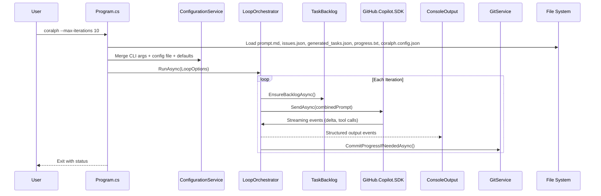

# Coralph Architecture

This document describes the high-level architecture of Coralph, an AI-powered development loop runner.

## Overview

Coralph is a .NET CLI application that orchestrates automated development workflows by:
1. Reading GitHub issues and a prompt template
2. Building merged runtime configuration from CLI flags and `coralph.config.json`
3. Running an AI assistant (via GitHub Copilot SDK) in a loop
4. Allowing the assistant to make changes, run tests, and commit code
5. Tracking progress across iterations and terminal signals

## Architecture Diagram

```mermaid
flowchart TD
    subgraph CLI["CLI Layer"]
        Main["Program.cs<br/>Entry Point"]
        ArgParser["ArgParser.cs<br/>Command Line Parsing"]
        Banner["Banner.cs<br/>ASCII Art & Version"]
        WorkingDir["WorkingDirectoryContext.cs<br/>Repository Directory Resolution"]
    end

    subgraph Config["Configuration"]
        LoopOptions["LoopOptions.cs<br/>Defaults + Overrides"]
        ConfigService["ConfigurationService.cs<br/>Config Loading + Merge"]
        RuntimePrep["LoopOptionsRuntimePreparation.cs<br/>Runtime Validation"]
    end

    subgraph Core["Core Orchestration"]
        Orchestrator["LoopOrchestrator.cs<br/>Iteration Lifecycle"]
        PromptHelpers["PromptHelpers.cs<br/>Prompt Assembly"]
        SessionRunner["CopilotSessionRunner.cs<br/>Persistent Copilot Session"]
        Runner["CopilotRunner.cs<br/>One-shot Execution"]
        TaskBacklog["TaskBacklog.cs<br/>Generated Task Sync"]
        GitService["GitService.cs<br/>Progress Commit Helper"]
        DockerSandbox["DockerSandbox.cs<br/>Containerized Iterations"]
    end

    subgraph Output["Output / UI"]
        ConsoleOutput["ConsoleOutput.cs<br/>Output Facade"]
        ConsoleSupervisor["ConsoleOutputSupervisor.cs<br/>Backend Lifecycle"]
        ClassicBackend["ClassicConsoleOutputBackend.cs<br/>Spectre Console Renderer"]
        TuiBackend["Hex1bConsoleOutputBackend.cs<br/>Hex1b Split-Pane TUI"]
        UiResolver["UiModeResolver.cs<br/>Mode Selection Logic"]
        TerminalSignal["TerminalSignal.cs<br/>Loop Stop Signals"]
    end

    subgraph Support["Support"]
        StartupValidation["StartupValidation.cs<br/>Prompt Validation"]
        BacklogCleanup["BacklogCleanup.cs<br/>Backlog Cleanup Rules"]
        CustomTools["CustomTools.cs<br/>AI-Callable Tools"]
        GhIssues["GhIssues.cs<br/>GitHub CLI Integration"]
    end

    subgraph External["External Dependencies"]
        CopilotSDK["GitHub.Copilot.SDK 0.1.32<br/>AI Runtime"]
        Hex1b["Hex1b 0.83.0<br/>TUI Framework"]
        ConfigJson["Microsoft.Extensions.Configuration.Json 8.0.0<br/>JSON Config Loading"]
        SpectreConsole["Spectre.Console 0.49.1<br/>Rich Terminal UI"]
        SystemCommandLine["System.CommandLine 2.0.0-beta4.22272.1<br/>CLI Parsing"]
    end

    subgraph Files["File System"]
        PromptMD["prompt.md<br/>Instructions Template"]
        IssuesJSON["issues.json<br/>GitHub Issues"]
        GeneratedTasksJSON["generated_tasks.json<br/>Persisted Backlog"]
        ProgressTXT["progress.txt<br/>Progress Journal"]
        ConfigFile["coralph.config.json<br/>Configuration Overrides"]
    end

    Main --> ArgParser
    Main --> Banner
    Main --> WorkingDir
    Main --> ConfigService
    Main --> RuntimePrep
    Main --> Orchestrator
    Main --> UiResolver
    Main --> ConfigFile

    ArgParser --> SystemCommandLine
    ConfigService --> ConfigJson
    ConfigService --> LoopOptions
    RuntimePrep --> LoopOptions

    Orchestrator --> PromptHelpers
    Orchestrator --> TaskBacklog
    Orchestrator --> SessionRunner
    Orchestrator --> Runner
    Orchestrator --> DockerSandbox
    Orchestrator --> GitService
    Orchestrator --> ConsoleOutput
    Orchestrator --> TerminalSignal
    Orchestrator --> BacklogCleanup
    Orchestrator --> StartupValidation
    Orchestrator --> CustomTools
    Orchestrator --> GhIssues

    ConsoleOutput --> ConsoleSupervisor
    ConsoleOutput --> ClassicBackend
    ConsoleOutput --> TuiBackend
    ClassicBackend --> SpectreConsole
    TuiBackend --> Hex1b

    PromptHelpers --> PromptMD
    TaskBacklog --> IssuesJSON
    TaskBacklog --> GeneratedTasksJSON
    PromptHelpers --> ProgressTXT
```

## Component Descriptions

### CLI Layer

| Component | Responsibility |
|-----------|----------------|
| **Program.cs** | Entry point; resolves working directory, parses args, boots init or loop |
| **ArgParser.cs** | Parses command-line arguments using System.CommandLine |
| **Banner.cs** | Displays animated ASCII banner and version information |
| **WorkingDirectoryContext.cs** | Resolves and applies `--working-dir` before the loop starts |

### Configuration

| Component | Responsibility |
|-----------|----------------|
| **LoopOptions.cs** | Configuration defaults and override model |
| **ConfigurationService.cs** | Loads JSON config and merges CLI args, config, and defaults |
| **LoopOptionsRuntimePreparation.cs** | Applies runtime-only adjustments and validation |

### Core Orchestration

| Component | Responsibility |
|-----------|----------------|
| **LoopOrchestrator.cs** | Coordinates iterations, terminal signals, and exit handling |
| **PromptHelpers.cs** | Builds the combined prompt from the template, issues, progress, and backlog |
| **CopilotSessionRunner.cs** | Maintains a persistent Copilot session across iterations |
| **CopilotRunner.cs** | Handles one-shot execution paths and fallbacks |
| **TaskBacklog.cs** | Syncs `generated_tasks.json` from open issues |
| **GitService.cs** | Commits progress updates when needed |
| **DockerSandbox.cs** | Runs iterations inside a container when sandboxing is enabled |

### Output / UI

| Component | Responsibility |
|-----------|----------------|
| **ConsoleOutput.cs** | Facade used by runtime code; routes output to the active backend |
| **ConsoleOutputSupervisor.cs** | Keeps the active backend healthy during long-running output |
| **ClassicConsoleOutputBackend.cs** | Spectre-based line output and styling |
| **Hex1bConsoleOutputBackend.cs** | Interactive split-pane TUI (transcript + generated tasks) |
| **UiModeResolver.cs** | Resolves effective mode from `--ui`, `--stream-events`, and redirection state |
| **TerminalSignal.cs** | Defines terminal stop markers such as `COMPLETE` and `NO_OPEN_ISSUES` |

### Support

| Component | Responsibility |
|-----------|----------------|
| **StartupValidation.cs** | Validates prompt and runtime prerequisites |
| **BacklogCleanup.cs** | Determines when generated backlog files should be removed |
| **CustomTools.cs** | Exposes AI-callable functions (list_open_issues, list_generated_tasks, get_progress_summary, search_progress) |
| **GhIssues.cs** | Fetches issues from GitHub using `gh` CLI |

## Data Flow

## External Dependencies

| Package | Version | Purpose |
|---------|---------|---------|
| **GitHub.Copilot.SDK** | 0.1.32 | AI runtime for Copilot integration |
| **Hex1b** | 0.83.0 | Interactive split-pane TUI rendering |
| **Microsoft.Extensions.Configuration.Json** | 8.0.0 | Load configuration from JSON files |
| **Microsoft.Extensions.Options.ConfigurationExtensions** | 8.0.0 | Bind configuration to options classes |
| **Spectre.Console** | 0.49.1 | Rich terminal output (colors, styling) |
| **System.CommandLine** | 2.0.0-beta4.22272.1 | CLI argument parsing and help generation |

## File Dependencies

| File | Purpose | Required |
|------|---------|----------|
| `prompt.md` | Instructions template for the AI assistant | Yes |
| `issues.json` | GitHub issues to process (can be refreshed with `--refresh-issues`) | Yes (can be empty `[]`) |
| `generated_tasks.json` | Persisted task backlog generated from issues | No (created if missing) |
| `progress.txt` | Learning journal tracking completed work | No (created if missing) |
| `coralph.config.json` | Configuration overrides | No (uses defaults) |

## Key Design Decisions

1. **Streaming Architecture**: Uses event-based streaming from GitHub.Copilot.SDK for real-time output
2. **Pluggable Output Backends**: Runtime logic writes to a single facade; rendering is switched between classic and TUI modes
3. **Stream Compatibility Guardrail**: `--stream-events` forces classic output to preserve JSONL integrations
4. **Tool Extensibility**: Custom AI tools exposed via `AIFunctionFactory.Create()` pattern
5. **Configuration Layering**: CLI args override config file, which overrides defaults
6. **Progress as Learning Journal**: Assistant writes structured summaries with learnings, not raw output
7. **Terminal Signals Are Validated**: `COMPLETE` is ignored while open backlog items remain; `NO_OPEN_ISSUES` and `ALL_TASKS_COMPLETE` also stop the loop
